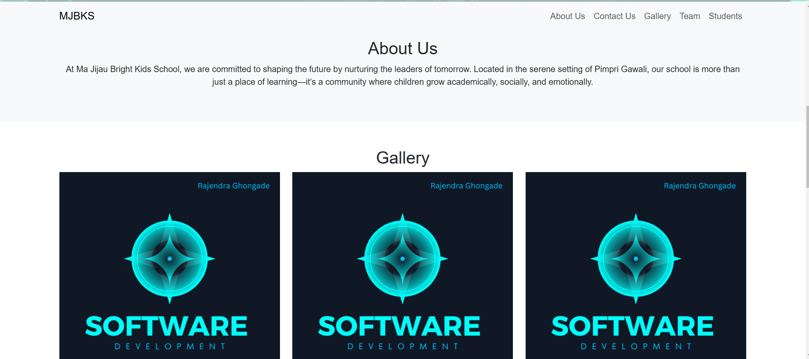
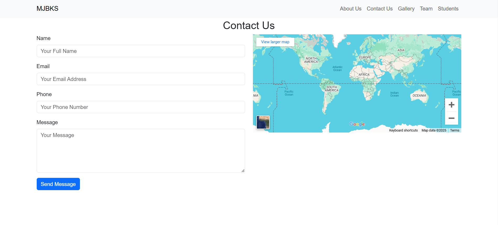

# Ma Jijau Bright Kids School Website 🌟

Welcome to the official repository for the **Ma Jijau Bright Kids School** website! This project showcases a beautifully crafted website for the school, built using **HTML**, **CSS**, and **JavaScript**. The website emphasizes quality education and aims to inspire the leaders of tomorrow.

---

## 🎯 Project Overview

**Ma Jijau Bright Kids School** is dedicated to empowering young minds with quality education. The website reflects the school's mission to nurture and inspire the next generation of leaders through an engaging and informative digital platform.

---

### Key Features:
- **Responsive Design:** Fully optimized for desktop, tablet, and mobile devices.
- **User-Friendly Interface:** Clear navigation for parents, students, and visitors.
- **Modern Aesthetic:** Designed with a vibrant, visually appealing layout.
- **Interactive Elements:** Animations and dynamic content provide a lively user experience.
- **Information Hub:** Pages for programs, admissions, contact details, and more.

---

## 💻 Technologies Used

- **HTML5:** For website structure and content organization.
- **CSS3:** For styling, layout, and responsive design.
- **JavaScript:** For dynamic content and interactive features.

---

## 📸 Screenshots

### Homepage


### About Us Page


### Stap Page


### Contact Page



---

## 🎥 Demo Video

### Watch the Full Walkthrough

[screen-capture (1).webm]()

*Note: Add your demo video in the `assets/videos` folder and provide a video thumbnail.*

---

## 🚀 Getting Started

Follow these steps to set up the project locally:

1. **Clone the Repository:**
   ```bash
   git clone https://github.com/rjghongade/ma-jijau-bright-kids-school.git
   cd ma-jijau-bright-kids-school

🤝 Contributing
Contributions are welcome! If you have suggestions or improvements:

Fork the repository.
Create a new branch: git checkout -b feature-name.
Commit your changes: git commit -m 'Added new feature'.
Push to the branch: git push origin feature-name.
Submit a pull request.

📞 Contact
Have questions or suggestions? Reach out here:

Email: rajughongade9022@gmail.com
GitHub: rjghongade

📜 License
This project is licensed under the MIT License. Feel free to use and modify the code as needed.
